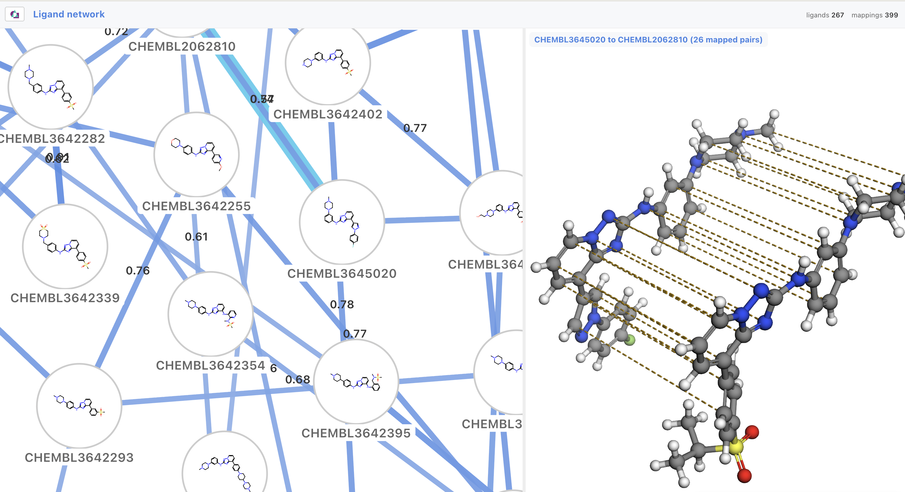

# alchemy-viz

Browser-based visualizations for [OpenFE](https://docs.openfree.energy/en/latest/index.html)
and [gufe](https://github.com/OpenFreeEnergy/gufe) objects: ligands, proteins,
atom mappings, ligand networks and alchemical campaigns.

<figure>
 <a href="https://framejs.app/j/e59fd6f18b2248adbd7e1fcb59aaeec2">
    
  </a>
  <figcaption><i>Click the image to see interactive examples</i></figcaption>
</figure>

## Install

Install into the environment that already has openfe or gufe. The compiled
JavaScript ships in the wheel, so there is no Node toolchain involved.

```bash
conda activate my-openfe-env
pip install "alchemy-viz[notebook]"   # the notebook extra is optional
```

gufe is **not** declared as a dependency: the only gufe on PyPI is 0.4, which
predates the 1.0 API, so a hard requirement would make `pip install` fail for
everyone. The check moved to import time instead, and points at conda-forge.

## Use

There is no conversion step and no alchemy-viz object model - `view()` takes
whatever openfe handed you.

```python
from alchemy_viz import view, to_html

view(network)        # a LigandNetwork, in a notebook cell
view(ligand)         # a SmallMoleculeComponent, ProteinComponent, ChemicalSystem...
html = to_html(obj)  # the same page as a string; writes nothing
```

`view()` is always an explicit call: nothing is patched, no `_repr_html_` is
overridden, and uninstalling changes nothing.

From the shell, on files `openfe plan-rbfe-network` wrote:

```bash
alchemy-viz network_setup/network_setup.json -o campaign.html
alchemy-viz network_setup/ligand_network.graphml     # writes <input>.html beside it
alchemy-viz ligand.json -o -                         # or stdout
```

The input may be a serialized gufe object or an alchemy-viz payload JSON; both
produce one self-contained HTML file. `alchemy-viz --help` has the rest.

The [demo notebook](./examples/notebooks/alchemy-viz-demo.ipynb) runs all of the
above. The [gallery notebook](./examples/notebooks/alchemy-viz-gallery.ipynb) is
the screenshotted version, because GitHub strips the `<iframe>` and `<script>`
that `view()` emits.

### Embedding the bundle

Importing the ES module registers every element; setting `.payload` is the whole
API.

```html
<script type="module" src="alchemy-viz.js"></script>
<alchemy-view id="v" style="width:100%;height:600px"></alchemy-view>
<script type="module">
  document.getElementById("v").payload = await (await fetch("payload.json")).json();
</script>
```

`alchemy_viz.bundle_source()` returns that bundle as a string.

### Debugging

Open any generated page as `<url>?debug` and the payload is printed to the
console, before validation and before dispatch. `to_html(obj, debug=True)` bakes
the switch in; `window.ALCHEMY_VIZ_DEBUG = true` works for a host that mounts
the element itself.

## Development

[pixi](https://pixi.sh) and git are the whole list of prerequisites; everything
else - Python, Node, gufe, RDKit, pytest - comes from `pixi.toml`.

```bash
git clone https://github.com/omsf-eco-infra/alchemy-viz.git
cd alchemy-viz
pixi install
pixi run dev     # vite: /gallery.html, /gallery-all.html, /parity.html, / (dropzone)
pixi run test    # both suites
pixi run ci      # what CI runs: lint, tests, generated-artifact freshness
```

`pixi run --list` has every task with a description.

### How it fits together

Python serializes a gufe object into a flat payload; compiled TypeScript custom
elements draw it. `schema/alchemy-viz.schema.json` is the contract between them
and the source of truth - it is hand-written, and both sides validate against
that one file.

Only SDF, PDB and flat JSON cross the boundary. gufe's own `to_json` never does,
including via GraphML, whose nodes *are* gufe moldicts - keeping deduplicated
key-chains and `:custom:` codecs a Python problem.

A payload has no envelope: it is its `type`, its `gufe-key` and its own fields.
References to other objects are by key, and the objects themselves are carried
once in the root payload's `registry`.

```json
{
  "type": "ChemicalSystemViz",
  "gufe-key": "ChemicalSystem-b51f409f...",
  "components": { "ligand": "SmallMoleculeComponent-ec3c7a92..." },
  "registry": [
    { "type": "SmallMoleculeComponentViz", "gufe-key": "SmallMoleculeComponent-ec3c7a92...", "sdf": "..." }
  ]
}
```

One schema object per gufe class, `additionalProperties: false` everywhere, and
`type` as a closed discriminator. See [`schema/README.md`](./schema/README.md).

Three artifacts are generated and committed - `ts/src/schema/types.ts`,
`python/alchemy_viz/_assets/alchemy-viz.js` and `examples/*.json`. Committing the
bundle is what lets `pip install` work without Node. `pixi run check-generated`
fails on any drift:

```bash
pixi run examples && pixi run types && pixi run build   # the fix, always
```

### Keeping the two sides honest

`examples/*.json` feeds pytest, vitest, the dropzone and the gallery.
`python/tests/mutations.json` declares a mutation matrix once, as data, and both
suites apply it against the same schema file: most rows must be rejected by both
validators at the same JSON pointer, and a few must still be accepted - garbage
chemistry inside a valid payload, an edge naming a missing ligand. Schema
validity is not chemical validity.

No test reaches the network: RDKit, 3Dmol and d3 are faked through
`globalThis.__gufeEngines`, the same pre-seed hook a bundled-engines mode would
use. The suites stop at that boundary, so use the dev server to check that
anything actually draws.

### Adding a view

1. Add a `$def` to `schema/alchemy-viz.schema.json`, named exactly for the
   `type` const it declares - both validators find a branch by that name.
2. Build the payload in `python/alchemy_viz/` (`components.py`, `networks.py` or
   `alchemical.py`) and add it to the `isinstance` dispatch. Ask the gufe object
   to serialize itself; never reach into its JSON.
3. `pixi run types`.
4. Write `ts/src/views/<type>.ts`: a class extending `AlchemyElement<Payload>`
   with one `renderView(host, payload)`, returning `{ onResize, cleanup }` if it
   owns anything that must be released.
5. Add the tag to `VIEW_TAGS` in `ts/src/alchemy-view.ts` and an import in
   `ts/src/index.ts`.
6. `pixi run examples`, add mutation rows, then `pixi run build && pixi run test`.

A declared type with no view renders as "no visualization for X yet", which is
correct behaviour; a view whose type the schema does not declare fails the tests.

### Layout

```
schema/     the Python<->TypeScript contract, and the mutation matrix
python/     alchemy_viz - payload builders, HTML writer, notebook view, CLI
ts/         the custom elements; src/views one per payload type, src/shared
            the machinery they are built from
examples/   golden payloads, shared by pytest, vitest, the dropzone and the gallery
scripts/    the generators
```

## Releasing

setuptools-scm derives the version from the git tag, so tagging is the release:

```bash
git tag -a v0.1.0 -m "v0.1.0" && git push origin v0.1.0
```

That fires `.github/workflows/release.yml`, which builds the sdist and wheel,
installs the wheel into a clean environment with no Node and no gufe, renders a
payload with it, and only then uploads via [PyPI Trusted
Publishing](https://docs.pypi.org/trusted-publishers/). Rehearse first with
*Actions -> Release -> Run workflow*, which uploads to TestPyPI instead; PyPI
refuses to re-upload a filename, so a real release is one-shot.

`pixi run dist` and `pixi run dist-check` do the same locally.

## Status

Every type the schema declares has a view, asserted by
`ts/tests/dispatch.test.ts`. Not published to PyPI yet.

Still to come: an `engines="bundled"` mode for zero-network pages (the
`__gufeEngines` hook is in place, so today's pages fetch RDKit, 3Dmol and d3 from
a CDN on demand), a conda-forge feedstock, and the transfer to the OpenFE org.

## Support

This work was supported by the [National Science Foundation under Grant No.
2303740](https://nsf.elsevierpure.com/en/projects/pose-phase-ii-building-open-source-ecosystems-in-molecular-scienc-2/),
via the [Open Molecular Science Foundation](https://omsf.io/).

## Licence

MIT.
