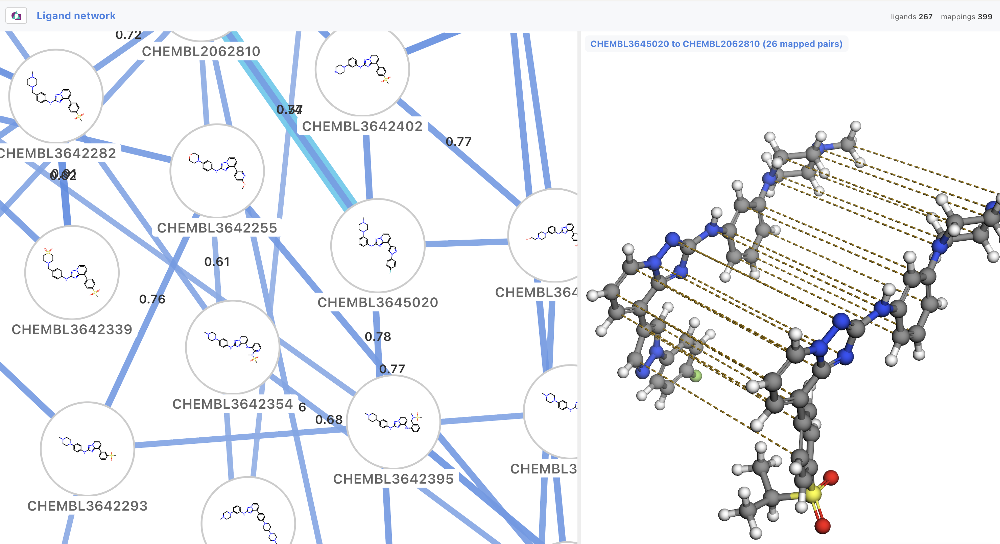

# alchemy-viz

Browser-based visualizations for [OpenFE](https://docs.openfree.energy/en/latest/index.html)
and [gufe](https://github.com/OpenFreeEnergy/gufe) objects: ligands, proteins,
atom mappings, ligand networks and alchemical campaigns.

<figure>
 <a href="https://framejs.app/j/e59fd6f18b2248adbd7e1fcb59aaeec2">
    
  </a>
  <figcaption><i>Click the image to see interactive examples</i></figcaption>
</figure>

## Install

```bash
conda activate my-openfe-env
pip install "alchemy-viz[notebook]"   # the notebook extra is optional
```

`gufe` must be installed from conda-forge, not pip.

## Use

From the shell, `alchemy-viz` accepts as inputs anything from `openfe plan-rbfe-network`:

```bash
alchemy-viz network_setup/network_setup.json -o campaign.html
alchemy-viz network_setup/ligand_network.graphml     # writes <input>.html beside it
alchemy-viz ligand.json -o -                         # or stdout
```

One self-contained HTML file is created.

From Python, on the object itself:

```python
from alchemy_viz import view, to_html

view(network)        # a LigandNetwork, drawn in a notebook cell
view(ligand)         # a SmallMoleculeComponent, ProteinComponent, ChemicalSystem...
html = to_html(obj)  # the same page as a string; writes nothing
```

`view()` takes a live gufe object or an alchemy-viz payload dict.

## Documentation

| Doc | Description |
|---|---|
| [`cli.md`](./docs/cli.md) | `alchemy-viz object.json` - input formats, options, errors |
| [`openfe.md`](./docs/openfe.md) | `view()` on your own objects, a `network_setup/` directory, planning in Python |
| [`notebooks.md`](./docs/notebooks.md) | how the notebook integration works |
| [`views.md`](./docs/views.md) |  |
| [`embedding.md`](./docs/embedding.md) | mounting the bundle in a page of your own |
| [`troubleshooting.md`](./docs/troubleshooting.md) | blank cells, missing depictions, payloads that will not draw |

Two notebooks:
[demo](./examples/notebooks/alchemy-viz-demo.ipynb) is basic usage
while
[gallery](./examples/notebooks/alchemy-viz-gallery.ipynb) shows the examples as images so you can see the outputs in github

## Development

Requires [pixi](https://pixi.sh).

```bash
git clone https://github.com/omsf-eco-infra/alchemy-viz.git
cd alchemy-viz
pixi install
pixi run dev     # vite: /gallery.html, /gallery-all.html, /parity.html, / (dropzone)
pixi run test    # both suites
pixi run ci      # what CI runs: lint, tests, generated-artifact freshness
```


### Adding a view

1. Add a `$def` to `schema/alchemy-viz.schema.json`, named exactly for the
   `type` const it declares - both validators find a branch by that name.
2. Build the payload in `python/alchemy_viz/` (`components.py`, `networks.py` or
   `alchemical.py`) and add it to the `isinstance` dispatch. Ask the gufe object
   to serialize itself; never reach into its JSON.
3. `pixi run types`.
4. Write `ts/src/views/<type>.ts`: a class extending `AlchemyElement<Payload>`
   with one `renderView(host, payload)`, returning `{ onResize, cleanup }` if it
   owns anything that must be released.
5. Add the tag to `VIEW_TAGS` in `ts/src/alchemy-view.ts` and an import in
   `ts/src/index.ts`.
6. `pixi run examples`, add mutation rows, then `pixi run build && pixi run test`.
7. Add a row to the table in [`docs/views.md`](./docs/views.md) and a `NOTES`
   entry in `scripts/make_gallery.py`, then `pixi run gallery`. Neither is
   checked by CI, so a new view is invisible in the docs until this step.

A declared type with no view renders as "no visualization for X yet", which is
correct behaviour; a view whose type the schema does not declare fails the tests.

## Releasing

setuptools-scm derives the version from the git tag, so tagging is the release:

```bash
git tag -a v0.1.0 -m "v0.1.0" && git push origin v0.1.0
```

## Support

This work was supported by the [National Science Foundation under Grant No.
2303740](https://nsf.elsevierpure.com/en/projects/pose-phase-ii-building-open-source-ecosystems-in-molecular-scienc-2/),
via the [Open Molecular Science Foundation](https://omsf.io/).

## Licence

MIT.
